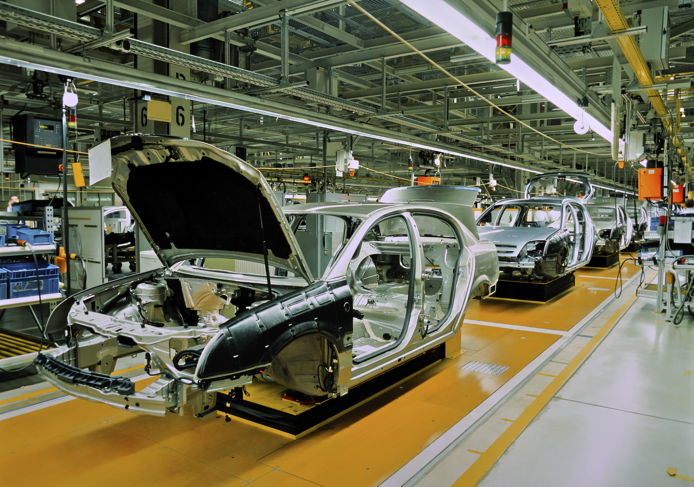

Documentation for: Car Order System
===========================

-------

A system to Order New Cars

  

-------

**This System does the following:**

The Car Ordering System is an advanced digital platform designed to streamline and simplify the process of ordering a car from a dealership or manufacturer. This system provides customers with a convenient and efficient way to customize, select, and order their desired vehicle, offering a seamless experience from start to finish.

**Key Features:**

- **Vehicle Configuration:** The system allows customers to select their desired car model and customize various features such as exterior color, interior upholstery, technology packages, optional accessories, and more. Users can visualize their selections in real-time through interactive 3D models or detailed images.

- **Inventory Management:** The system integrates with the dealership's inventory database to provide customers with up-to-date information on available car models, trims, and options. It ensures that customers can only configure vehicles that are currently in stock or available for order.

- **Pricing and Financing Options:** The system provides transparent pricing information, including base prices, optional features, and any applicable discounts or promotions. It also offers financing options, allowing customers to explore lease or loan terms, estimate monthly payments, and submit credit applications securely.

- **Trade-in Evaluation:** For customers looking to trade in their existing vehicle, the system may incorporate a trade-in evaluation feature. Users can input details about their current car, such as make, model, mileage, and condition, to receive an estimated trade-in value. This value can be factored into the overall pricing and financing calculations.

- **Secure Ordering and Payment:** Once customers have finalized their vehicle configuration, the system enables them to place an order securely. It may require users to create an account or log in to track their order status. Payments can be made using various methods, such as credit/debit cards, online banking transfers, or financing options, ensuring a hassle-free and secure transaction.

- **Order Tracking and Updates:** The system provides customers with real-time updates on the progress of their order, from production to delivery. Users can track their vehicle's manufacturing status, estimated delivery date, and receive notifications when significant milestones are reached. This feature enhances transparency and keeps customers informed throughout the process.

- **Communication and Support:** The system includes communication channels, such as email notifications, SMS updates, or a dedicated customer support portal, to facilitate smooth communication between customers and dealership representatives. Customers can reach out to ask questions, request assistance, or make changes to their order if permitted.

**Benefits:**

**Convenient and Time-Saving:** Customers can configure and order their desired car at their convenience, eliminating the need for multiple visits to the dealership.
Enhanced Customization: The system enables customers to personalize their vehicle by selecting from a range of options, ensuring they receive a car tailored to their preferences.
Transparency and Pricing Clarity: Customers have access to transparent pricing information and financing options, promoting trust and informed decision-making.
Improved Order Management: The system simplifies the order management process for dealerships, ensuring accurate inventory tracking, reducing errors, and increasing efficiency.
Enhanced Customer Experience: By providing real-time updates, secure transactions, and effective communication channels, the system enhances the overall customer experience and satisfaction.
In summary, the Car Ordering System revolutionizes the car-buying experience by providing customers with a user-friendly platform to configure, order, and track their vehicle orders seamlessly. It combines customization, inventory management, transparent pricing, and efficient communication to enhance customer satisfaction and streamline dealership operations.

